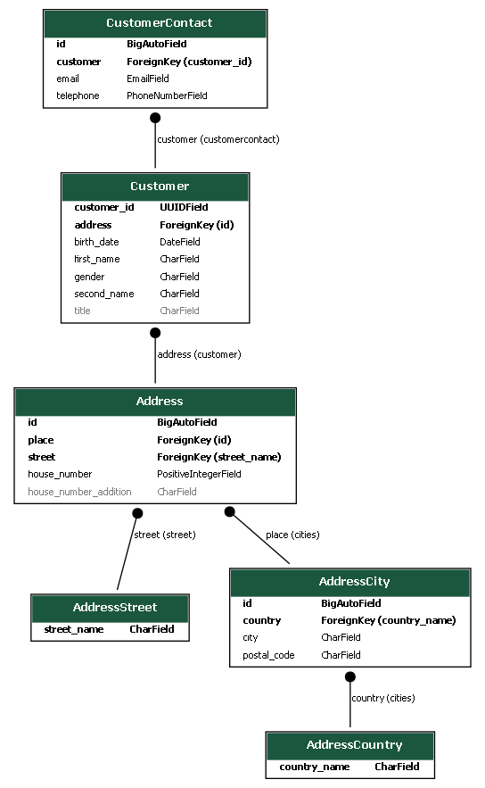
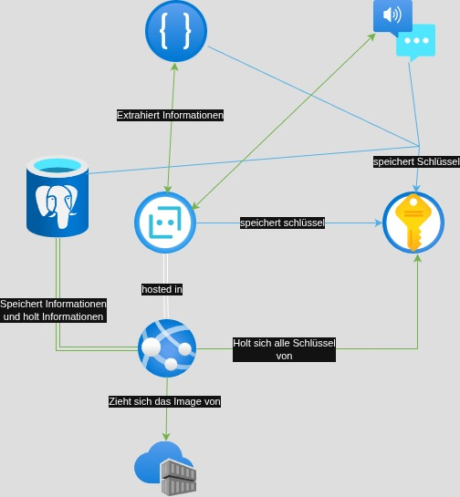

# Azure Voice Bot - User Account Registration System

A sophisticated voice-enabled chatbot built with Azure services and Django Framework that conducts natural language conversations to systematically collect and store complete user account information.

You can explore a live example of the project [here](https://fgtcc-e6e7b3anbtbwg7hz.canadacentral-01.azurewebsites.net/).
For interactions via Telegram, use the bot: [@Registrierungs_bot](https://t.me/Registrierungs_bot)


## Overview

This semester project demonstrates the integration of multiple Azure cognitive services to create an intelligent voice bot capable of:

- **Natural Language Processing**: Understanding user intent and extracting relevant information from conversational input
- **Speech Recognition & Synthesis**: Converting speech to text and text to speech for seamless voice interactions
- **Systematic Data Collection**: Gathering complete user profiles including personal, contact, and address information
- **Secure Data Storage**: Storing user data in Azure SQL Database with proper security measures
- **Scalable Architecture**: Built using dependency injection and singleton patterns for maintainability

### Key Features

- Voice-enabled conversational interface
- Intelligent data extraction from natural language
- Complete user account creation workflow
- Multi-language support through Azure Speech Services
- Secure secrets management with Azure Key Vault
- Containerized deployment with Docker

## Architecture

The system follows a modular architecture combining Django Framework with some addons and Microsoft Bot Framework, implementing dependency injection and singleton design patterns for optimal performance and maintainability.

### Database Schema



*The database schema includes five main entities: Customer (address key, birth date, first name, second name, gender, title), Address (place key, street key, house number, house number addition), AddressStreet (street name), AddressCity (country key, city, postal code) and AddressCountry (country name)*

### Azure Resources Architecture



*Complete Azure infrastructure showing the interaction between Bot Service, Speech Services, Language Understanding, SQL Database, App Service, Key Vault, and Container Registry*

### Azure Services Used

| Service | Purpose |
|---------|---------|
| **Azure Bot Service** | Core bot framework and channel management |
| **Azure Speech Services** | Speech-to-text and text-to-speech conversion |
| **Azure Language Understanding (LUIS/CLU)** | Natural language processing and intent recognition |
| **Azure SQL Database** | Secure user data storage |
| **Azure App Service** | Web application hosting |
| **Azure Key Vault** | Secrets and configuration management |
| **Azure Container Registry** | Docker image storage and deployment |

### Sequence Diagram


*Flow diagram illustrating the conversation process from user speech input through data extraction to database storage*

### API Endpoints

The application provides several endpoints for different functionalities:

### Authentication & Admin
| Endpoint | Method | Description | Function |
|----------|--------|-------------|----------|
| `/` | GET/POST | Superuser login page (ReAuth) | `SuperuserLoginView` |
| `/adminboard/` | GET | Admin dashboard for managing users | `admin_dashboard` |

### Statistics & Reports
| Endpoint | Method | Description | Function |
|----------|--------|-------------|----------|
| `/statistics/` | GET | View customer statistics and charts | `customer_stats` |
| `/adminboard/statistics/pdf/<chart_type>/` | GET | Download statistics as PDF | `customer_stats_pdf` |

### Bot Integration
| Endpoint | Method | Description | Function |
|----------|--------|-------------|----------|
| `/webchat/` | GET | Web chat interface for bot interaction | `webchat` |
| `/api/webchat/token/` | GET | Get DirectLine token for web chat | `get_directline_token` |
| `/api/messages/` | POST | Bot Framework messaging endpoint | `messages` |


## Data Collection

The bot systematically collects the following user information:

### Personal Data
- First Name
- Last Name  
- Date of Birth
- Gender
- Title

### Contact Information
- Email Address
- Phone Number

### Address Details
- Street Address
- House Number
- House Number Addition
- Postal Code
- City
- Country

## Getting Started

### Prerequisites

- Python 3.8 or higher
- Azure subscription
- Docker Desktop
- Git

### Environment Setup

1. **Clone the repository**
   ```bash
   git clone https://github.com/yourusername/azure-voice-bot.git
   cd azure-voice-bot
   ```

2. **Create virtual environment**
   ```bash
   python -m venv venv
   source venv/bin/activate  # On Windows: venv\Scripts\activate
   ```

3. **Install dependencies**
   ```bash
   pip install -r requirements.txt
   ```
   
   **Note**: For using WeasyPrint, please follow the installation instructions: https://doc.courtbouillon.org/weasyprint/stable/first_steps.html#installation

4. **Configure Azure services** (see detailed setup instructions below)
   - Create Azure Bot Service resource
   - Set up Speech Services
   - Configure Conversational Language Understanding (CLU)
   - Create Azure SQL Database
   - Set up Key Vault for secrets
   - Create Azure Container Registry

## Azure Resources Setup

Before deploying the application, you need to create the following Azure resources. Follow the detailed steps below:

### 1. Resource Group

1. Navigate to the Azure Portal (https://portal.azure.com)
2. In the left menu, click **"Resource groups"**
3. Click **"+ Create"**
4. Fill in the required information:
   - **Subscription**: Select your subscription
   - **Resource group name**: Enter a unique name (e.g., `rg-voicebot-prod`)
   - **Region**: Choose the Azure region (e.g., West Europe)
5. Click **"Review + Create"**
6. Click **"Create"** to finish

### 2. Azure Key Vault

1. Click **"Create a resource"** > search for **"Key Vault"** > **Create**
2. Fill in:
   - **Name**: e.g., `my-keyvault`
   - **Region**: Same as your Web App
   - **Pricing tier**: Standard
   - **Resource Group**: Use the existing one created above
3. Click **"Review + create"** > **"Create"**

**Adding Secrets to Key Vault:**
1. In Key Vault > **Secrets** > **+ Generate/Import**
2. Enter the required secrets (see list below in Azure Deployment section)
3. Click **Create** for each secret

### 3. Azure SQL Database

1. Click **"Create a resource"** > search for **"SQL Database"** > click **"Create"**
2. In the **Basics** tab:
   - **Subscription**: Select your subscription
   - **Resource group**: Choose the existing one created above
   - **Database name**: Enter a name (e.g., `voicebot-db`)
   - **Server**: Click **"Create new"**, enter:
     - Server name
     - Admin login & password
     - Choose a region
3. **Compute + storage**: Click **"Configure database"** to select a pricing tier
4. **Networking**: Configure access (allow Azure services and your IP)
   - **Note**: For local development, add your current IP under SQL Database → Security → Network → Add your current IPv4 address → Save
5. Click **"Review + create"** > **"Create"**

### 4. Azure Container Registry

1. Click **"Create a resource"** > search for **"Container Registry"** > **"Create"**
2. Fill in the details:
   - **Subscription**: Select your subscription
   - **Resource group**: Choose the existing one
   - **Registry name**: Must be globally unique (e.g., `myregistry123`)
   - **Location**: Choose a region
   - **SKU**: Select a tier (e.g., Basic, Standard, or Premium)
   - Select RBAC permissions
3. Click **"Review + create"** > **"Create"**

### 5. Azure App Service

1. Click **"Create a resource"** > search for **"Web App"** > click **"Create"**
2. Fill in the **Basics**:
   - **Subscription**: Choose your subscription
   - **Resource group**: Select the existing one
   - **Name**: e.g., `mywebapp123`
   - **Publish**: Select **"Docker Container"**
   - **Operating System**: Choose **Linux**
   - **Region**: Choose a region close to you
3. Under **Docker**:
   - **Options**: Choose **Azure Container Registry**
   - **Registry**: Select your ACR (e.g., `myregistry123`)
   - **Image**: Choose your container image
   - **Tag**: Select the tag (e.g., `latest`)
4. Click **Next** through other tabs, then **"Review + Create"** > **"Create"**

**Post-Deployment Configuration:**

#### Enable System-Assigned Managed Identity
1. Go to your Web App > **"Identity"**
2. Under **System assigned**, switch **Status** to **"On"**
3. Click **"Save"**

#### Assign AcrPull Role to Web App
1. Go to your **Container Registry (ACR)**
2. Click **"Access control (IAM)"** > **"Add role assignment"**
3. Select:
   - **Role**: `AcrPull`
   - **Assign access to**: **Managed identity**
   - **Managed identity type**: App Service
   - **Select**: Your Web App
4. Click **"Review + assign"**

#### Configure Application Settings
1. Navigate to your **App Service** > **"Settings"** > **Environment variables**
2. Add the following settings:

| Name | Value (example) |
|------|-----------------|
| `AZURE_KEYVAULT_URL` | `https://myvault.vault.azure.net/` |
| `BOT_URL` | `https://mybot.azurewebsites.net/` |
| `WEBSITE_URL` | `https://mywebapp.azurewebsites.net/` |

3. Click **"Save"** and restart the Web App

#### Grant Key Vault Access
1. Go to your **Key Vault** > **"Access policies"**
2. Click **"+ Create"**
3. Configure from template: `Secret Management`
4. Under **Principal**: Select your **Web App's name**
5. Click **"Add"**, then **"Save"**

### 6. Azure Bot Service

1. Click **"Create a resource"** > AI + Machine Learning > **Azure Bot** > **"Create"**
2. Fill in the **Basics**:
   - **Bot handle**: Unique name (e.g., `my-global-bot`)
   - **Subscription**: Choose your subscription
   - **Resource Group**: Select existing
   - **Region**: Choose a global region (e.g., `West Europe`)
   - **Pricing tier**: F0 (free) or S1 (standard)
   - **Type of App**: Multitenant

#### Configure Microsoft App ID
1. Under **Microsoft App ID**, select **"Create new Microsoft App ID and password"**
2. Click **"Register"**

#### Create Client Secret
1. Go to the bot > Configuration > Microsoft App ID (manage)
2. Go to **"Certificates & secrets"** > **"+ New client secret"**
3. Add description and expiry, click **"Add"**
4. **Copy the secret value immediately** - store it in the keyvault

#### Configure Channels
**Web Chat Channel:**
1. In **Channels** page, click **"Web Chat"**
2. Click **"Save"** - copy the secret keys for embedding and store it in the keyvault

**Telegram Channel (Optional):**
1. Create bot with @BotFather in Telegram
2. Get Bot Token from BotFather
3. In Azure > Bot Service > Channels > **"Telegram"**
4. Paste Bot Token and save

### 7. Azure Cognitive Services (Speech + CLU)

#### Create Speech Service
1. Click **"Create a resource"** > search for **"Speech"** > **"Create"**
2. Fill in:
   - **Name**: e.g., `my-speech-service`
   - **Region**: e.g., `West Europe` (must match your LUIS region)
   - **Pricing tier**: `F0` (free) or `S0`
3. Get Key and Endpoint from **Keys and Endpoint** section

#### Create Language Understanding Service
1. Click **"Create a resource"** > search for **"Language Understanding"**
2. Choose **"Authoring"** for LUIS
3. Configure region to match Speech service
4. Access LUIS Portal (https://www.luis.ai) to create and train your model

**CLU Model Training**: Create and train your Conversational Language Understanding model in Language Studio


*Note: Replace placeholder values (your-keyvault-name, your-webapp-name, etc.) with your actual resource names*

## Installation

### Local Development/Testing

1. **Configure environment variables**
   Create a `.env` file in the project root:
   ```env
   # Bot Framework Configuration
   BOT_FRAMEWORK_BOT_ID=your-bot-framework-id
   BOT_FRAMEWORK_SECRET=your-bot-framework-secret
   BOT_ID=your-bot-id
   BOT_PASSWORT=your-bot-password
   MICROSOFT_APP_PASSWORD=your-microsoft-app-password
   
   # Conversational Language Understanding
   CLU_DEPLOYMENT_NAME=your-clu-deployment
   CLU_ENDPOINT=your-clu-endpoint
   CLU_KEY=your-clu-key
   CLU_PROJECT_NAME=your-clu-project
   
   # Cognitive Services
   AZURE_SPEECH_REGION=your-speech-region
   COG_ENDPOINT=your-cognitive-endpoint
   COG_KEY=your-cognitive-key
   
   # Webchat
   DIRECT_LINE_SECRET=your-direct-line-key
   
   # Database Configuration
   DB_HOST=your-db-host
   DB_NAME=your-db-name
   DB_PASSWORT=your-db-password
   DB_PORT=1433
   DB_USER=your-db-user
   
   # Django Configuration
   SECRET_KEY=your-django-secret-key
   
   # Key Vault
   AZURE_KEYVAULT_URL=https://your-keyvault.vault.azure.net/
   ```
   
   **Note**: Generate Django secret key at: https://djecrety.ir/

2. **Initialize database**
   ```bash
   python manage.py makemigrations
   python manage.py migrate
   ```

3. **Run the application**
   
   For local development without Key Vault, add `isDocker = true` variable:
   ```bash
   uvicorn FCCSemesterAufgabe.asgi:application --port 8000
   ```

### Docker Deployment

1. **Build Docker image**
   ```bash
   docker build -t azure-voice-bot .
   ```

2. **Run container**
   For local development without Key Vault, add `isDocker = true` variable:
   ```bash
   docker run -p 8000:8000 --env-file .env azure-voice-bot
   ```

3. **Tag image for Azure Container Registry** (optional)
   ```bash
   docker tag azure-voice-bot:latest {your_azure_docker_registry_name}.azurecr.io/azure-voice-bot:v1.0.0
   ```

### Azure Deployment

1. **Set up Azure Key Vault with required secrets**
   
   Add the following secrets to your Key Vault:
   ```
   BOT-FRAMEWORK-BOT-ID = ""
   BOT-FRAMEWORK-SECRET = ""
   AZURE-SPEECH-REGION = ""
   BOT-ID = ""
   BOT-PASSWORT = ""
   CLU-DEPLOYMENT-NAME = ""
   CLU-ENDPOINT = ""
   CLU-KEY = ""
   CLU-PROJECT-NAME = ""
   COG-ENDPOINT = ""
   COG-KEY = ""
   DB-HOST = ""
   DB-NAME = ""
   DB-PASSWORT = ""
   DB-PORT = ""
   DB-USER = ""
   SECRET-KEY = ""
   DIRECT-LINE-SECRET=""
   ```

2. **Push to Azure Container Registry**
   ```bash
   az acr login --name {your-registry}
   docker push {your_azure_docker_registry_name}.azurecr.io/azure-voice-bot:v1.0.0
   ```

## GitHub Actions CI/CD Setup

For automated deployment, configure the following secrets in your GitHub repository:

### Required GitHub Secrets

| Variable | Description | Example |
|----------|-------------|---------|
| `AZURE_CREDENTIALS` | Service Principal JSON for Azure authentication | `{"clientId": "...", "clientSecret": "..."}` |
| `AZURE_KEYVAULT_URL` | URL of your Azure Key Vault | `https://your-keyvault.vault.azure.net/` |
| `DB_HOST` | Azure SQL Database server hostname | `your-server.database.windows.net` |
| `DB_NAME` | Database name | `voicebot_db` |
| `DB_PASSWORD` | Database password | `YourSecurePassword123!` |
| `DB_USER` | Database username | `your_admin_user` |
| `DJANGO_SECRET_KEY` | Django application secret key | `your-django-secret-key` |
| `IMAGE_NAME` | Docker image name | `azure-voice-bot` |
| `REGISTRY_NAME` | Azure Container Registry name | `yourregistry` |
| `RESOURCE_GROUP_NAME` | Azure Resource Group name | `rg-voicebot-prod` |
| `BOT_URL` | Bot endpoint URL | `https://your-webapp-name.azurewebsites.net` |
| `WEBSITE_URL` | Website URL | `https://your-webapp-name.azurewebsites.net` |

### Create Azure Service Principal

1. **Login to Azure CLI**
   ```bash
   az login
   ```

2. **Get your subscription ID**
   ```bash
   az account show --query id --output tsv
   ```

3. **Create service principal**
   ```bash
   az ad sp create-for-rbac \
     --name "github-deploy-sp" \
     --role contributor \
     --scopes /subscriptions/<SUBSCRIPTION_ID>/resourceGroups/<RESOURCE_GROUP_NAME> \
     --sdk-auth
   ```

4. **Save the JSON output as `AZURE_CREDENTIALS` secret in GitHub**

5. **Use the workflow file** `.github/workflows/dockerbuildpush.yml`

## Usage

1. Start a conversation with the bot through any configured channel (Web Chat, Teams, Telegram, etc.)
2. The bot will greet you and begin the account registration process
3. Provide information naturally through voice or text
4. The bot will ask follow-up questions to complete missing information
5. Confirm your details before final account creation

## Troubleshooting

### Common Issues

1. **Key Vault Access Denied**
   - Ensure the Web App's managed identity has proper access policies
   - Verify Key Vault URL is correct in environment variables

2. **Database Connection Failed**
   - Check if your IP is whitelisted in SQL Database networking settings
   - Verify database credentials in Key Vault

3. **Bot Authentication Issues**
   - Ensure Bot Framework App ID and password are correctly configured
   - Check if the messaging endpoint is properly set

4. **Container Registry Access Denied**
   - Verify the Web App has `AcrPull` role on the container registry
   - Check if the image tag exists in the registry
